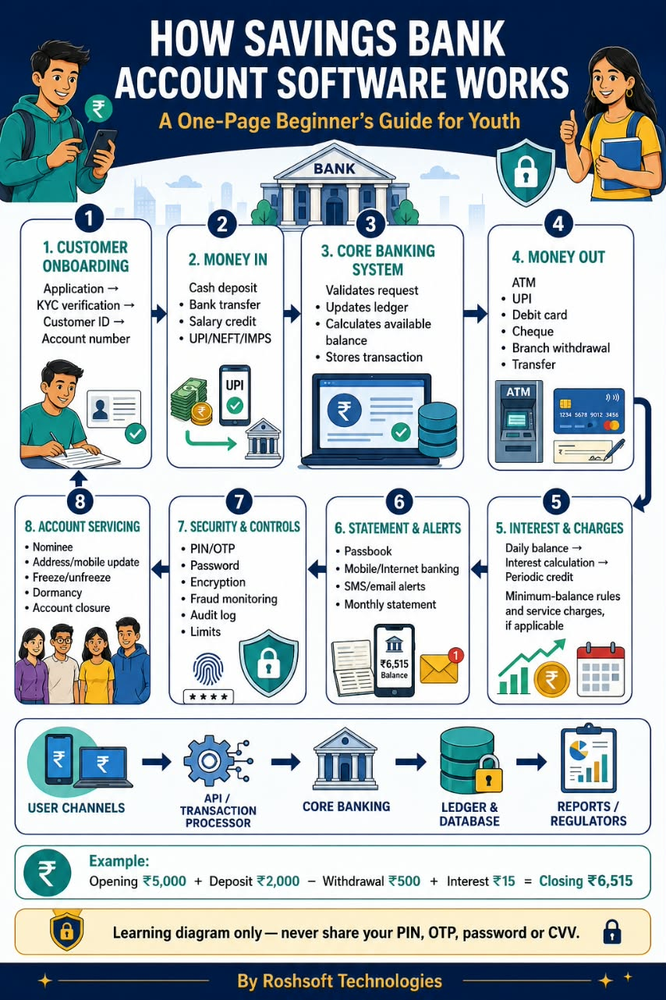
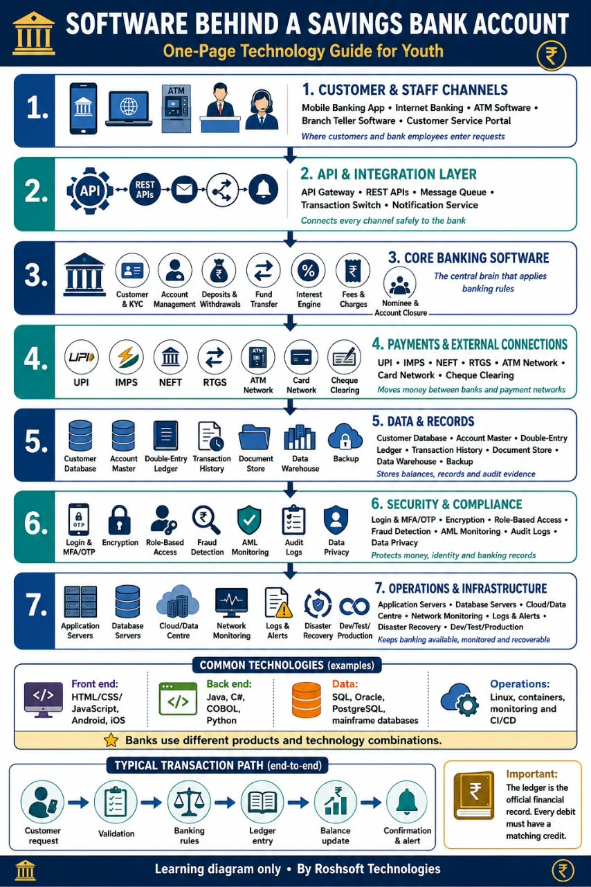
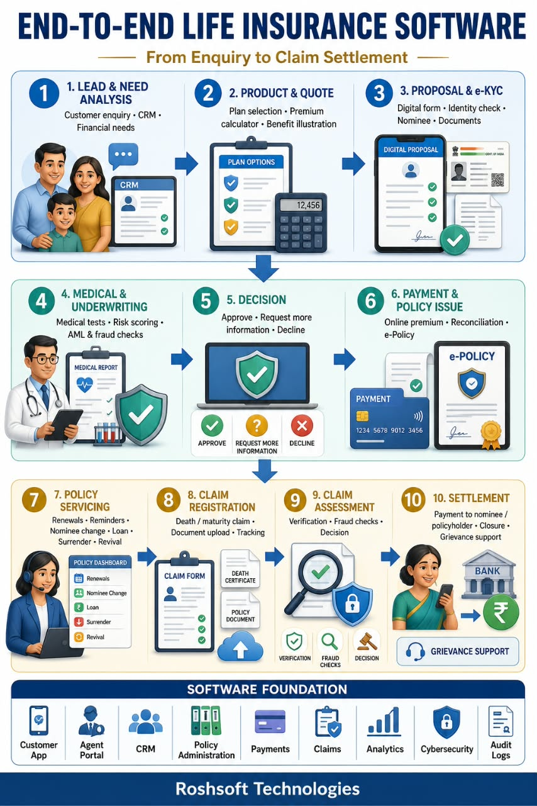
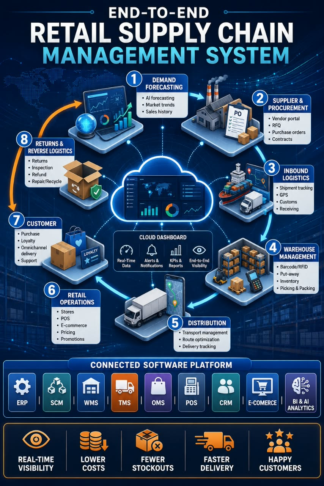
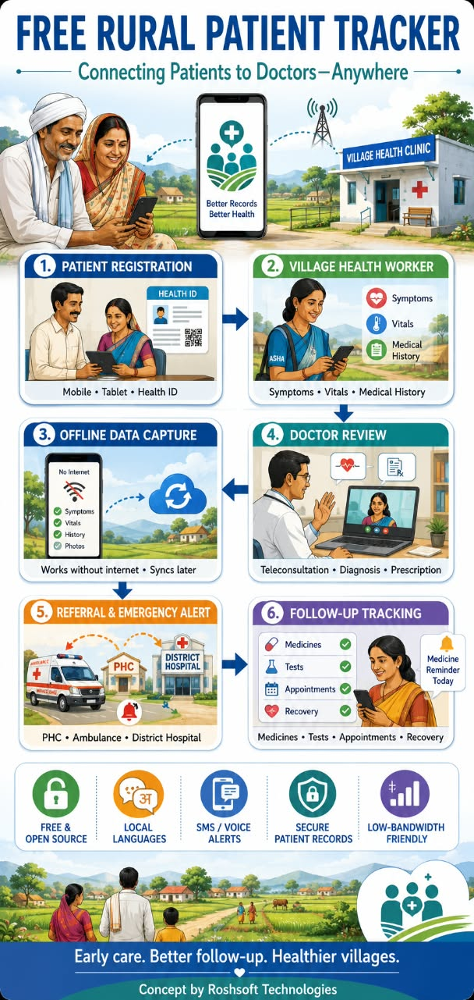

# 📚 ForeverYoung Global - Domain Learning Resources

Welcome to the centralized knowledge hub for *ForeverYoung Global*. This repository hosts domain-specific learning resources, software architecture workflows, and system architecture guides designed to help youth master core industry systems.

---

## 🏦 Banking Domain

### 1. How Savings Bank Account Software Works
A one-page beginner's guide focusing on the functional flow from onboarding, money movements, and interest calculations to statement servicing.

### 2. The Software Behind a Savings Bank Account
A detailed technical guide exploring the full architecture stack including integration layers, APIs, data structures, and infrastructure foundations.

---

## 🏥 Insurance Domain

### 3. End-to-End Life Insurance Software
An in-depth map outlining the life cycle of insurance tech, following operations from the initial enquiry, risk underwriting, and policy issuance to claim settlement.

---

## 📦 Retail & Logistics Domain

### 4. End-to-End Retail Supply Chain Management System
A comprehensive overview of a modern connected supply chain platform, visualizing demand forecasting, warehouse management operations, distribution logistics, and reverse flows.

---

## 🩺 Healthcare Domain

### 5. Free Rural Patient Tracker Workflow
A step-by-step blueprint visualizing a rural healthcare platform. It highlights patient registration, offline data synchronization, doctor teleconsultations, and emergency referral alerts.

---

⚠️ *Security & General Reminder:* These assets serve as structural learning diagrams and domain overviews only. Always practice secure data handling and privacy compliance. Never share live personal credentials, financial PINs, or patient record datasets.
